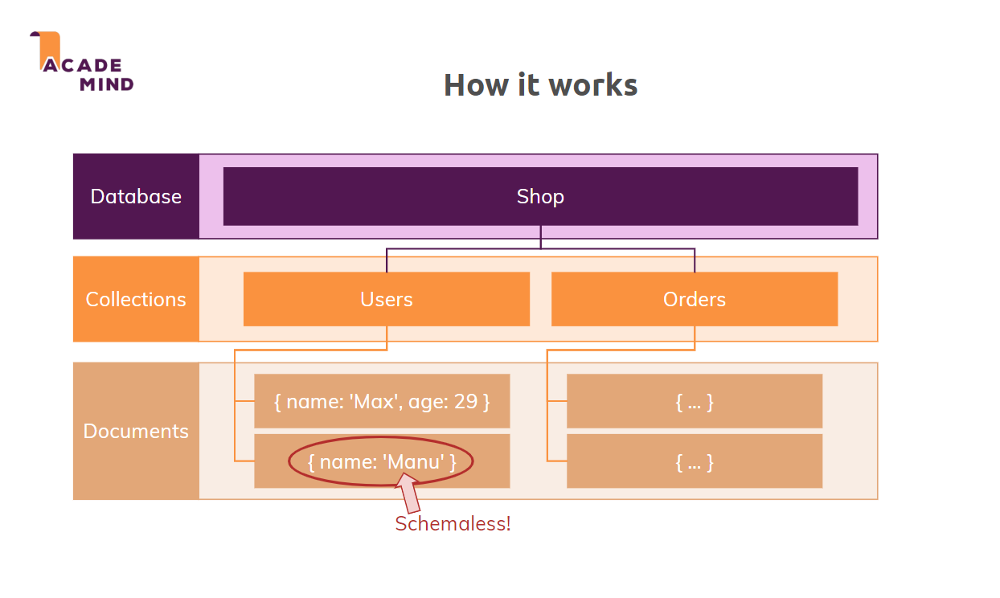

# MongoDB note

NhanNguyen

some little note by myself to remind what did i learn

---

## Things worth to review:

| No. | Content                                                               |
| --- | --------------------------------------------------------------------- |
|     |                                                                       |
| 1   | [Overview - Basic](#section-01-the-basic)                             |

# Section 01 - THE BASIC

`MongoDB` is a server allow us to create mutiple databases in `MongoDB`. 

- `Collections` in mongoDB equivalent to `Tables` in `Sql server` 

- `Documents` is stored in `Collections` and it is schemaless

